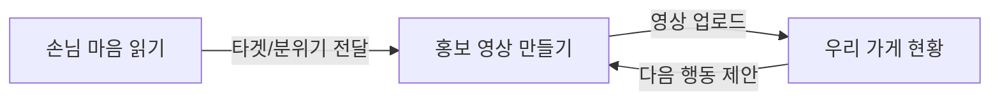
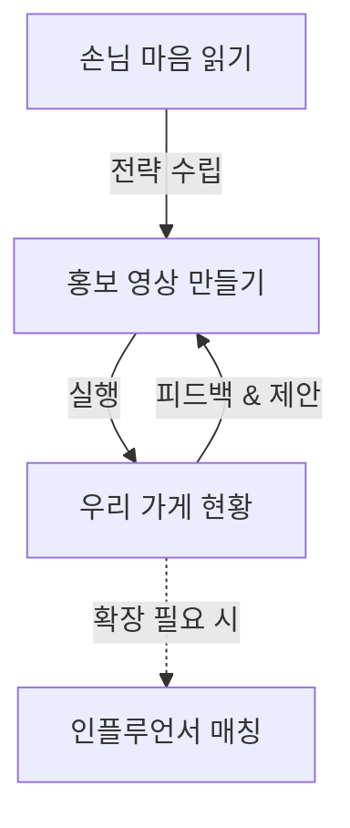

### *외식업 사장님을 위한 통합 마케팅 자동화 플랫폼*

---

# 1. 프로젝트 개요

## 1.1 서비스 정의

**PULSE**는 외식업 자영업자가 겪고 있는

**마케팅 지식 부족 · 시간 부족 · 신뢰할 전문가 부족**이라는 3대 문제를 해결하기 위해 만들어진

**지능형 마케팅 자동화 플랫폼**이다.

PULSE는 외식업 사장님이 직접 마케팅을 공부하거나 촬영·편집 기술을 익히지 않아도

 **손님 마음 읽기 → 홍보 영상 만들기 → 우리 가게 현황 → 인플루언서 협찬(Pro)**

까지 이어지는 하나의 일관된 홍보 루프를 제공한다.

이 프로젝트의 핵심은 “사장님이 마케팅을 잘하게 만드는 것이 아니라, 마케팅이 사장님 없이도 굴러가게 만드는 것”이다.

본 프로젝트의 1차 목표(MVP 범위)는

- 손님 마음 읽기 (리뷰 입력 기반, 상권 패턴은 정적 데이터)
- 홍보 영상 만들기 (사진 업로드 → 템플릿 기반 mp4 생성)
- 우리 가게 현황 (사용자 입력 기반 성과/행동 제안)
    
    를 구현하여 하나의 end-to-end 루프를 완성하는 것이다.
    
    8장의 확장 기능은 정보 구조 및 화면 설계 수준까지 포함하되,
    
    실제 개발·연동은 추후 단계에서 진행한다.
    

---

# 2. 문제 정의

업로드된 조사 자료와 면담 내용을 정리하면, 외식업 사장님은 세 가지 장벽 때문에 마케팅에 어려움을 겪고 있다.

## 2.1 지식의 장벽

- 디지털 마케팅 경험 거의 없음
- 상권 데이터·리뷰 분석·고객 세그먼트 이해 불가
- 숏폼 시대의 콘텐츠 제작 기준을 따라가기 어려움
- 어떤 손님을 대상으로 어떤 콘텐츠를 만들지 결정 못함

## 2.2 비용·신뢰의 장벽

- 배달앱, 플랫폼 광고비 부담 큼
- 불투명한 광고 구조, 과다 수수료
- 전문가 도움을 받고 싶지만 신뢰할 곳을 찾기 어려움

## 2.3 시간의 장벽

- 조리·서빙·정산까지 혼자 다 처리
- 콘텐츠 촬영·편집할 시간이 없음
- 영세 음식점일수록 마케팅이 뒤로 밀림

따라서 **사장님은 “마케팅이 필요함”을 알고 있지만, 실질적으로 실행할 여력이 없다.**

---

# 3. PULSE의 해결 방식

PULSE는 이 문제를 **세 단계의 자동화 루프**로 해결한다.

1단계. **손님 마음 읽기**

→ 고객의 리뷰와 상권 데이터를 분석해 손님 유형을 단 1줄로 요약하고, **AI가 대화하듯 마케팅 전략을 코칭**해줌

(예: “퇴근 손님 비중 높음 — 19~21시 업로드 추천”)

2단계. **홍보 영상 만들기**

→ **타겟(페르소나)만 고르고** 사진을 업로드하면, **AI가 기획안(Storyboard)부터** 숏폼 영상까지 원스톱 생성

3단계. **우리 가게 현황**

→ **지난주 성과를 분석**해, 복잡한 그래프 대신 **“오늘 당장 해야 할 행동(Mission)”**을 1줄로 제안

(예: “저장률 감소 — 문구 강조형 템플릿으로 영상 제작 추천”)

**이 3단계가 한 번에 돌아가면 사장님은 디지털 마케팅을 스스로 하지 않아도 된다.**

여기에 Pro 요금제를 통해 고품질 홍보가 필요한 사장님을 위해

**인플루언서 협찬 매칭** 기능이 제공된다.

---

# 4. 핵심 기능

세부 기능은 다음 네 가지로 구성된다. (핵심 루프 3개 + Pro 추가 기능 1개)

---

# **4.1 손님 마음 읽기 (Guest Insight)**

### *온라인 리뷰 및 지역 상권 데이터를 활용한 고객 니즈 요약 기능*

**손님 마음 읽기**는 외식업 사장님이 복잡한 분석 과정 없이

**“우리 가게 손님이 무엇을 좋아하고, 어떤 콘텐츠가 효과적인지”**

즉시 파악할 수 있도록 설계된 지능형 분석 기능이다.

---

## **4.1.1 분석 구조 (Unified Insight Model)**

손님 마음 읽기는 **두 가지 분석 관점을 하나의 통합된 화면**에서 제공한다.

### **A) 통합 리스트 뷰 (Unified List View)**

좌측 리스트에서 **"주변 상권 분석(Macro)"**과 **"개별 페르소나(Micro)"**를 자유롭게 선택하여 조회할 수 있다.

- **주변 상권 분석**: 지역 전체의 유동인구, 시간대별 특성, 뜨는 키워드를 파악한다.
- **페르소나 분석**: "해장하는 30대", "알뜰 직장인" 등 구체적인 고객 유형을 클릭하여 상세 니즈를 파악한다.

### **B) 맥락적 연동 (Contextual Connection)**

어떤 대상을 선택하느냐에 따라 우측 상세 화면이 즉시 전환되며,
해당 인사이트를 바탕으로 바로 **[이 손님 맞춤 릴스 제작]**으로 연결된다.

---

## **4.1.2 손님 AI 대화 기능(Guest Chat)**

### *헤더 상단 아이콘을 통한 즉각적인 AI 질문 기능*

손님 AI 대화 기능은 **헤더 우측 상단의 메시지 아이콘(Inline Chat)**을 통해 언제든 접근 가능하다.

분석된 데이터(페르소나, 상권 정보)를 바탕으로
사장님이 궁금한 점을 채팅으로 물어보면 AI가 즉시 답변해준다.

이 기능은 복잡한 데이터 해석 없이
**"오늘 점심엔 어떤 메뉴를 행사할까?"**와 같은 자연어 질문만으로
인사이트를 활용할 수 있게 돕는다.

---

# **4.2 홍보 영상 만들기 (Smart Reels Studio)**

### *사진만 올리면 손님 인사이트에 맞는 릴스를 자동 생성하는 핵심 기능*

**홍보 영상 만들기**는

외식업 사장님이 **촬영·편집 지식 없이도**

“손님 인사이트에 맞는 SNS용 짧은 홍보 영상(릴스)”을 만들 수 있도록 돕는 기능이다.

사장님은 **타겟(페르소나)만 고르고 사진을 업로드**하면,

PULSE가 손님 인사이트에서 도출된 핵심 메시지와 리뷰 키워드, 상권 패턴을 활용하여

**기획안(Storyboard)부터 구성·자막·문구가 포함된 세로형 9:16 짧은 영상**을 자동으로 만들어 준다.

---

## **4.2.1 컨텍스트 기반 네비게이션 (Context-Aware Navigation)**

PULSE의 가장 강력한 특징 중 하나는 **"데이터가 흐르는 네비게이션"**이다.

사장님이 대시보드나 분석 페이지에서 "홍보 영상 만들기" 버튼을 누르면,

단순히 페이지가 이동하는 것이 아니라 **"무엇을 만들지"에 대한 정보가 함께 전달**된다.

- **From 대시보드:** "퇴근길 직장인 타겟" (Vibe: **에너지**) → **영상 제목과 분위기 자동 세팅**
- **From 손님 마음 읽기:** "단골 손님 시그니처 메뉴" (Vibe: **무드**) → **영상 제목과 분위기 자동 세팅**
- **From 상권 분석:** "우리 동네 핫플레이스" (Vibe: **프리미엄**) → **영상 제목과 분위기 자동 세팅**

이를 통해 사장님은 "제목을 뭐로 하지?", "어떤 분위기로 만들지?" 고민할 필요 없이,

**사진만 업로드하면 바로 최적화된 영상이 생성**되는 경험을 하게 된다.

---

## **4.2.2 내부 처리 로직**

홍보 영상 만들기 기능은

다음 3단계로 영상 결과물을 생성한다.

### ① 기획 및 구성 설계 (Planning & Structure)

- 전달받은 **Context(제목, 분위기)**와 업로드된 사진을 분석하여 **기획안(Storyboard)** 생성.
- **HOOK - BODY - OUTRO**의 숏폼 문법 적용.
- 사용자가 기획안을 확인하고 수정할 수 있는 단계 제공.

### ② 장면 및 자막 생성

- 사진 수에 따른 컷 분할 및 트랜지션 적용.
- **3가지 스타일(에너지, 프리미엄, 무드)** 중 선택된 분위기에 맞는 폰트, 컬러, 모션 그래픽 자동 적용.

### ③ 영상 설정 및 출력

- 9:16 세로형 영상 (mp4).
- SNS 업로드에 최적화된 6~10초 길이.

---

# **4.3 우리 가게 현황 (Store Dashboard)**

### *숫자를 보는 것이 아니라, “다음 행동”을 보여주는 행동 중심 대시보드*

**우리 가게 현황**은 SNS 운영 초보자인 외식업 사장님이

복잡한 지표나 그래프가 아니라

- *“지금 무엇을 해야 하는지”**만 빠르게 이해하도록 설계된 PULSE만의 경량 대시보드이다.

**No Scroll Policy**를 적용하여, 스크롤 없이 한 화면에서 모든 정보를 파악할 수 있다.

---

## **4.3.1 제공 요소 및 데이터 구조**

대시보드는 **매장 브리핑 - 상세 분석**의 2단 구조로 구성된다.

### **① 매장 브리핑 (Store Briefing)**

- **날씨 & 시즌 알림:** 현재 날씨(비/맑음)와 계절 이슈(장마, 폭염 등)를 결합하여 메뉴 추천 및 주의사항 안내.
- **AI 제안 (Hero Section):** 화면 중앙에 가장 크게 배치된 **행동 중심(Action-Centric)** 영역. "비 오는 날엔 파전 검색 급증!"과 같이 구체적인 행동을 제안하고 **[영상 만들기]** 버튼으로 즉시 연결.

### **② 상세 분석 (Detailed Analysis)**

- **주간 성과:** 지난 7일간의 매장 검색량 및 방문자 추이를 직관적인 그래프로 시각화.
- **주요 지표:** 방문자 수 증감률, 검색량 증감률 등 핵심 트래픽 데이터 제공.
- **(상세한 감정 분석과 키워드는 '손님 마음 읽기' 메뉴에서 심층적으로 제공)**

---

# **4.4 리뷰 관리 & 답변 (Review Management)**

### *AI가 제안하는 답글로 리뷰 관리 시간을 단축*

바쁜 사장님을 위해, 긍정/부정 리뷰를 자동으로 분류하고 적절한 답글을 AI가 제안해주는 기능이다.
감정 분석을 통해 고객의 숨은 의도를 파악하고, 진정성 있는 소통을 돕는다.

---

# **4.5 인플루언서 매칭 (Pro 요금제 전용)**

### *가게에 맞는 인플루언서를 추천받고, 협찬 홍보를 진행하는 기능*

이 기능은 핵심 기능은 아니지만 **핵심 BM(수익모델)**이기 때문에

프로 요금제에 반드시 포함된다.

### 구조

### ① 추천

- 손님 마음 읽기 기반
- 업종·스타일·메뉴 특징에 맞는 푸드 크리에이터 추천
- 인플루언서 프로필(포트폴리오/선호 콘텐츠 유형 등)

### ② 검색

- 사장님이 직접 검색 가능
- 업종·콘셉트 중심 필터 기반

### ③ 협찬 의뢰

- 사장님 → 인플루언서에게 협찬 요청
- 인플루언서가 직접 방문해 시식
- 영상/블로그 제작 후 **자신의 계정에 업로드**

### ④ 홍보 효과

- 업로드된 콘텐츠를 통해 자연스러운 사용자 유입
- 지역 로컬 푸드 크리에이터와 상생 구조 구축

---

# 5. 서비스 구조 (IA 개념)

---

## **5.1 기본 루프 (모든 사용자)**

### **핵심 기능 3단계로 구성된 ‘마케팅 실행 루프’**

기본 루프는 모든 사용자가 공통적으로 경험하는 PULSE의 중심 구조다.

각 기능은 단독이 아닌, 다음 기능으로 자연스럽게 이어지는 **행동 중심 구조(Action-to-Action Flow)**로 설계되었다.

---

## **① 손님 마음 읽기 (Understand)**

**"우리 가게 손님을 이해하고, 마케팅 방향을 결정하는 단계"**

**Input**

- 온라인 리뷰 데이터
- 지역 상권 정보

**Process**

- BERTopic 기반 의미 분석
- 상권 패턴 매칭

**Output**

- **분석 화면:** 페르소나 카드, 핵심 니즈/불편 카드, 고객 여정 지도
- **플로팅 AI 채팅:** 궁금한 점을 즉시 물어볼 수 있는 대화형 인터페이스
- **Context 전달:** "이 손님 타겟으로 영상 만들기" 버튼 클릭 시, 타겟 정보와 분위기(Vibe)를 다음 단계로 전달

> 핵심 가치: 손님 이해 → 콘텐츠 방향 결정
> 

---

## **② 홍보 영상 만들기 (Create)**

**"결정된 방향에 맞춰, 실제 홍보 콘텐츠를 제작하는 단계"**

**Input**

- **Context:** 이전 단계에서 전달받은 타겟 및 분위기 (자동 입력)
- **User Asset:** 음식/매장 사진 업로드

**Process**

- **AI 기획:** 타겟에 맞는 스토리보드(Storyboard) 자동 생성
- **영상 합성:** 컷 편집, 자막 생성, 모션 그래픽, 배경음악 적용

**Output**

- **숏폼 영상 (9:16):** SNS(인스타그램 릴스, 유튜브 쇼츠) 업로드용 mp4 파일
- **기획안:** 영상의 구성 의도와 소구 포인트 설명

> 핵심 가치: 기획/편집 자동화 → 콘텐츠 제작 실행
> 

---

## **③ 우리 가게 현황 (Evaluate & Next Action)**

**"성과를 확인하고, 다음 행동을 제안받아 루프를 지속하는 단계"**

**Input**

- 지난주 성과 데이터
- 실시간 환경 변수(날씨, 시즌, 트렌드)

**Process**

- 성과 분석 및 행동 추천 알고리즘

**Output**

- **AI 제안 (Hero Section):** "비 오는 날 파전 영상 제작" 등 시의적절한 행동 1가지 제안
- **매장 브리핑:** 날씨/시즌 이슈에 따른 운영 팁 제공
- **성과 지표:** 지난주 대비 성장률, 고객 감정 온도, 인기 키워드
- **Loop Back:** 제안된 행동 버튼 클릭 시, 다시 **'홍보 영상 만들기'** 단계로 즉시 이동

> 핵심 가치: 성과 분석 → 다음 행동 실행 (재방문 유도)
> 

---

## ✔ **기본 루프 프로세스 요약**



이 루프는 사장님이 매일·매주 반복하게 되는 SNS 마케팅 습관을 자동으로 만들어내는 구조다.

---

## **화면명 / 목적 / 주요 구성 요소**

| 화면명 | 목적 | 주요 구성 요소 |
| --- | --- | --- |
| 온보딩/로그인 | 서비스 진입 | • 2단계 회원가입 (기본정보 → 가게정보)• 3D 인터랙티브 배경 (Premium Experience) |
| 대시보드 홈(우리 가게 현황) | 루프의 시작 & 성과 확인 | • AI 제안 (Hero): 가장 시급한 행동 가이드• 매장 브리핑: 날씨/시즌 기반 팁• 상세 분석: 주간 성과 그래프, 트렌드 위젯 |
| 손님 마음 읽기 | 전략 수립 | •  레이아웃: 페르소나 / 인사이트 카드 / 여정 지도• 플로팅 AI 채팅• CTA: "이 손님으로 영상 만들기" |
| 홍보 영상 만들기 | 콘텐츠 제작 | • 입력: 사진 업로드, 타겟/분위기 선택• 기획: AI 스토리보드 확인 및 수정• 결과: 숏폼 영상 프리뷰 및 다운로드 |
| Pro – 인플루언서 매칭 | 전문가 확장 | • 인플루언서 리스트, 필터링, 협찬 요청 |

---

# **5.2 Pro 루프 (프로 요금제 사용자)**

**BM 확장을 위한 별도 수익 루프**

Pro 루프는 기본 루프와 흐름을 공유하지 않는다.

사장님의 SNS 마케팅 실행을 더 확장하고 싶을 때 사용하는 독립 경로로 설계된다.

---

## **① 인플루언서 협찬 매칭 (Influencer Collaboration)**

가게의 업종·사진·인사이트 데이터를 기반으로 해당 가게와 잘 맞는 푸드 인플루언서를 추천해주는 기능이다.

### 기능 흐름

- **추천 (Recommend):** 우리 가게 스타일(분위기, 메뉴)에 맞는 인플루언서 자동 추천
- **탐색 (Discover):** 활동 지역, 팔로워 수, 주력 콘텐츠 스타일로 검색
- **의뢰 (Request):** 협찬 조건(제공 메뉴, 원고료 등) 설정 후 매칭 요청
- **홍보 (Promote):** 인플루언서 방문 및 콘텐츠 업로드 → 가게 인지도 상승

해당 기능은 핵심 마케팅 루프를 방해하지 않기 위해 Pro 영역에만 배치되며,

PULSE의 **핵심 수익 모델(BM)**이자 확장 수단으로 정의된다.

---

# **5.3 IA 구조적 특징**

PULSE의 IA는 다음 두 가지 원칙을 기반으로 설계되었다.

---

### **원칙 1. 핵심 플로우는 단일 루프만 유지한다.**

Understand → Create → Evaluate & Action

이 루프가 끊기면 서비스는 “마케팅 앱”이 아닌 “도구 모음”이 된다.

따라서 핵심 루프는 **단일 구조(Single Loop)**로 유지된다.

---

### **원칙 2. BM 기능은 절대 핵심 루프에 섞지 않는다.**

인플루언서 매칭은 Pro 전용 경로로 분리하여

핵심 경험을 해치지 않도록 설계한다.

이 구조는 다음 리스크를 제거한다.

- 기능 범위 과다
- 사용자 이탈
- 핵심 가치 희석

---

# **5.4 전체 IA 요약**

```
      [손님 마음 읽기]
              ↓ (Context 전달)
      [홍보 영상 만들기]
              ↓ (영상 업로드)
      [우리 가게 현황]
              ↓ (다음 행동 제안)
      (다시 영상 만들기 단계로 반복)

--------------------- Pro 경로 ---------------------

      [인플루언서 협찬 매칭] (별도 독립 경로)

```

---

# 6. 주요 설계 원칙

1. **기능 넓히지 말고 깊게**
2. **모든 결과는 1줄로 제공 후 하단에 간단한 설명을 작성**
3. **AI 생성이 플로우 1번**
4. **UI는 화려함보다 명확한 행동 중심 (Action-Centric)**
5. **기술 설명보다 왜 이 구조인지가 중요**
6. **사용자 시나리오 기반으로 설명할 것**

---

# **7. 사용자 시나리오 (User Scenario)**

### *사장님의 하루 작업 흐름에 따라 자연스럽게 동작하는 PULSE 경험*

---

## **📌 시나리오: “저녁 장사 치킨집 박 사장님"**

박 사장님은 퇴근 시간대 고객이 많은 치킨집을 운영하고 있다.
SNS 마케팅은 중요하다고 느끼지만, 직접 영상 편집을 하거나 마케팅 전략을 세울 시간은 없다.
오늘은 가게 홍보를 위해 PULSE를 처음 사용해본다.

---

### **① 손님 마음 읽기 (자동 분석)**

박 사장님은 대시보드에서 **"손님 마음 읽기"** 메뉴로 진입한다.
PULSE는 이미 수집된 리뷰와 상권 데이터를 분석해 3가지 핵심 카드를 보여준다.

- **가장 원해요(Needs):** “퇴근 후 시원한 맥주와 바삭한 치킨”
- **불편해요(Pain Points):** “포장 주문 대기 시간”
- **콘텐츠 추천:** “퇴근길 치킨·포장 컷 강조 추천”

우측 하단의 **플로팅 AI 채팅** 버튼을 눌러 물어본다.
*"오늘 저녁엔 어떤 영상을 올리면 좋을까?"*

AI가 답변한다.
*"퇴근길 직장인을 타겟으로, 시원한 맥주 따르는 소리가 담긴 영상을 추천해요!"*

박 사장님은 망설임 없이 **[이 손님으로 영상 만들기]** 버튼을 누른다.

---

### **② 홍보 영상 만들기 (기획부터 제작까지)**

화면이 바뀌면서 **"타겟: 퇴근길 직장인", "분위기: 에너지(Energetic)"**가 이미 세팅되어 있다.
박 사장님은 방금 찍은 **치킨 사진 2장**을 업로드한다.

**[영상 생성하기]** 버튼을 누르자, AI가 먼저 **기획안(Storyboard)**을 보여준다.

- **Scene 1:** 맥주 따르는 소리 (청각 자극)
- **Scene 2:** 바삭한 치킨 클로즈업 (시각 자극)
- **Scene 3:** "오늘 저녁은 여기!" 문구 (행동 유도)

*"오, 구성이 괜찮네?"*
박 사장님이 **[이대로 만들기]**를 확정하자, 10초 만에 고퀄리티 릴스가 완성된다.
박 사장님은 영상을 저장하고 인스타그램에 바로 업로드한다.

---

### **③ 우리 가게 현황 (다음 행동 제안)**

다음 날, 박 사장님은 가게에 출근해 PULSE 대시보드를 켠다.
복잡한 그래프 대신, 화면 중앙의 **Hero 섹션**에 명확한 메시지가 떠 있다.

> "어제 올린 영상 반응이 뜨거워요! (저장수 급증 🔥)""물 들어올 때 노 저으세요! 주말 예약 유도 영상을 만들어볼까요?"
> 

우측 **매장 브리핑** 위젯에는
*"내일은 비 소식이 있어요. 배달 강조 멘트를 넣어보세요."* 라는 팁이 보인다.

박 사장님은 고민 없이 다시 **[영상 만들기]** 버튼을 눌러,
비 오는 날을 대비한 배달 홍보 영상을 뚝딱 만들어낸다.

---

### **④ 마케팅 확장이 필요할 때 (Pro 기능)**

매출이 오르자 욕심이 생긴 박 사장님은 **Pro 기능**을 켜본다.
**인플루언서 매칭** 메뉴에 들어가니, 우리 가게 스타일과 딱 맞는 **"치킨 리뷰 전문 인플루언서"**가 추천된다.

- 활동 지역: 우리 동네 포함
- 주력 콘텐츠: 먹방/리뷰
- 팔로워 반응: 긍정적

박 사장님은 **[협찬 요청]** 버튼을 눌러 제안을 보내고,
인플루언서가 방문해 촬영한 영상이 올라가자 가게 인지도가 더욱 상승한다.

---

### **🔥 최종 시나리오 요약**

PULSE는 박 사장님이 마케팅 지식 없이도 다음과 같은 전체 흐름을 자연스럽게 경험하게 만든다.



---

# **8. 향후 확장 기능**

이후 PULSE는 외식업 사장님의 **지속적인 플랫폼 방문과 더 향상된 마케팅 효율**을 위해

다음과 같은 확장 기능들을 단계적으로 도입할 계획이다.

---

## 8.1 리뷰 허브 (Review Hub)

외식업 마케팅에서 리뷰는 중요한 콘텐츠 자원이자, 손님 반응을 직접적으로 보여주는 데이터이다.

향후 PULSE는 리뷰 기반 분석 기능을 강화하여 하나의 관리 허브로 확장한다.

### 주요 기능

- 신규 리뷰 감지 및 요약 제공
- 긍정/부정 리뷰 자동 분류
- 답변 문구 템플릿 제공
- 리뷰에서 추출된 키워드 기반 릴스 주제 추천
- 리뷰 변화에 따른 손님 인사이트 자동 업데이트

### 기대효과

- 사장님이 리뷰 관리에 들이는 시간을 절감
- 리뷰 → 인사이트 → 콘텐츠 제작으로 이어지는 마케팅 루프 강화

---

## 8.2 사진 보관함(콘텐츠 박스) & 자동 분류

사장님이 촬영한 음식·매장 사진을 **콘텐츠 자산**으로 관리할 수 있는 기능이다.

### 주요 기능

- 사진 자동 분류(메뉴/매장/세트/신메뉴 등)
- 사용 여부 표시(이미 업로드한 사진 vs 미사용 사진)
- 사진 보관함에서 바로 “이 사진으로 릴스 제작” 연결
- 사진 품질·구도 개선 팁 제공(간단한 텍스트 형태)

### 기대효과

- 콘텐츠 제작 준비 과정을 단축
- 콘텐츠 자산을 한곳에서 관리하며 재방문 증가

---

## 8.3 홍보 점수(PULSE Score)

사장님의 SNS 마케팅 활동을 한눈에 파악할 수 있도록

손님 반응·릴스 업로드 패턴·콘텐츠 품질 등을 종합해 산출하는 점수 시스템이다.

### 주요 기능

- 0~100점 단위의 가게 홍보 점수 제공
- 점수 하락 원인 한 줄 표시
- 점수 상승을 위한 간단한 행동 제안
- 릴스 제작·리뷰 반응·업로드 주기 등과 연동

### 기대효과

- 사장님이 자신의 홍보 상태를 금방 이해
- 점수 상승을 위해 자연스럽게 플랫폼 재방문

---

## 8.4 수수료 비교 분석

PDF에서 언급된 기능으로,

각 플랫폼(배달앱·SNS 광고·홍보 채널 등)의 수수료와 비용 대비 효율을 비교해

사장님에게 가장 합리적인 채널 선택을 안내한다.

### 기대효과

- 비용 대비 효과가 높은 홍보 전략 선택 가능
- 불필요한 비용 지출 감소

---

## 8.5 다채널 광고 전략 추천

리뷰·사진·손님 인사이트 기반으로

사장님에게 가장 적합한 광고 전략(시간대·콘텐츠 유형·광고 예산)을 제안한다.

### 기대효과

- 사장님의 광고 의사결정을 단순화
- 릴스 외의 콘텐츠 전략 확장 가능

---

## 8.6 고도화된 학습 콘텐츠

외식업 사장님이 직접 실천할 수 있는

초간단 마케팅 지침·사례·촬영 팁을 제공하는 콘텐츠 허브로 확장한다.

### 기대효과

- 사장님이 스스로도 지속적인 학습
- 콘텐츠 품질 상승 → 릴스 성과 개선

---

## 8.7 업종 확장

초기 업종(예: 치킨·중식·분식 등) 중심에서

카페·술집·디저트·브런치 등 다양한 외식업 카테고리로 확장한다.

(세분화)

### 기대효과

- 더 넓은 고객 대상 확보
- 업종별 손님 인사이트와 콘텐츠 전략 자동 제공

---

## 8.8 전문가 커뮤니티 기능

향후 Pro 기능과 연계하여

푸드 크리에이터, 촬영 전문가, 마케팅 전문가가

자신의 콘텐츠·포트폴리오를 공유할 수 있는 공간을 제공한다.

### 기대효과

- 전문가 생태계 형성
- 외식업-크리에이터 간 상생 구조 완성

---

## 8.9 템플릿 다양성 확대

스마트 릴스 자동제작 기능의 확장으로

업종별·계절별·트렌드 기반 템플릿을 지속적으로 추가한다.

### 기대효과

- 다양한 스타일의 홍보 영상을 쉽게 제작
- SNS 트렌드에 맞는 콘텐츠 유지

---

### 📌 확장 기능 종합 정리

| 분류 | 기능 | 목적 |
| --- | --- | --- |
| **지속사용 기반 기능** | 리뷰 허브 / 사진 보관함 / PULSE Score | 사장님이 자주 방문할 이유 제공 |
| **콘텐츠·마케팅 확장** | 템플릿 확대 / 다채널 전략 추천 / 학습 콘텐츠 | SNS 마케팅 효율 강화 |
| **비용·전략 고도화** | 수수료 비교 / 업종 확장 | 전략적 의사결정 지원 |
| **생태계 확장(Pro)** | 전문가 커뮤니티 | 크리에이터·사장님 상생 구조 강화 |

---

# 9. 기대 효과

PULSE가 제공하는 효과는 다음과 같다.

## 9.1 사장님에게

- 마케팅 진입장벽 제거
- 홍보 자동화 → 본업 집중 가능
- 고품질 협찬 콘텐츠로 매출 상승 가능
- 플랫폼 의존도 감소

## 9.2 크리에이터에게

- 로컬 음식점과의 안정적 협업 기회
- 새로운 수익 및 홍보 루트 확보
- 지역 기반 푸드 콘텐츠 활성화

## 9.3 지역 사회·경제에

- 로컬 맛집의 성장 → 상권 활성화
- 소상공인와 크리에이터 간 상생 구조
- 푸드 콘텐츠 산업 성장 기반

---

# **10. 플랫폼 선정 근거**

본 프로젝트의 플랫폼은 **웹(Web 기반 서비스)**으로 선정한다.

이는 본 프로젝트가 목표로 하는 **MVP 완성도, 시연 안정성, 일정 현실성**, 그리고 **사용자 특성**을 종합적으로 고려하여 도출한 최적의 선택이다.

## 10.1 사용자 특성 기반 판단

외식업 사장님은 디지털 문해력이 낮고, 새로운 앱 설치에 대한 진입장벽이 높다.

또한 사진 촬영·업로드는 모바일 환경을 사용하지만, **업무성 도구는 웹 기반 관리 페이지**를 선호하는 경향이 있다.

- 앱 설치에 대한 거부감 존재
- 카카오톡 링크 등으로 웹 접근 시 편의성 ↑
- 매장에서 PC로 발주/정산을 처리하는 비율도 여전히 높음

따라서 **웹 플랫폼은 “설치 없이 바로 사용 가능한 방식”이라는 점에서 사용자 접근성을 극대화한다.**

## 10.2 기능 구조와 서비스 목적 기반 판단

PULSE의 핵심 루프는

**손님 인사이트 → 스마트 릴스 자동제작 → 성과 대시보드**

로 구성된 “분석·생성·검증 SaaS 워크플로우”이다.

이 구조는 앱보다는 웹 환경에서 더 안정적으로 구현되며,

데이터 분석·대시보드 표시·크리에이터 협찬 매칭(Pro)과 같은 업무형 기능은 **웹 SaaS UX에 최적화**되어 있다.

또한 Pro 기능인 **크리에이터 협찬 매칭**은

프로필·포트폴리오 열람, 필터 기반 검색 등

웹 기반 관리자 화면이 더 자연스럽고 효율적이다.


## 10.3 향후 확장성 관점의 선택

본 MVP에서는 웹 기반이 적합하지만,

PULSE가 실제 서비스로 출시될 경우

사장님의 촬영·업로드·SNS 연동 패턴을 고려하면

향후 모바일 앱 확장은 필수적이다.

따라서 로드맵은 아래와 같이 설정한다.

- **1단계(MVP)**: 웹 기반 서비스 (프론트·백엔드 안정 구현)
- **2단계(상용화)**: 웹 + 모바일 앱(하이브리드)
    - 릴스 제작/업로드 → 앱 중심
    - 분석/매칭/대시보드 → 웹 중심

웹과 앱의 역할을 분리하는 하이브리드 구조가

장기적으로 사용자 경험과 확장성 모두를 확보하는 방향이다.

---

# **11. 디자인 시스템 (Design System)**

PULSE는 사용자에게 **"전문적이지만 어렵지 않은"** 경험을 제공하기 위해
**신뢰감 있는 딥 블루(Deep Blue)**와 **행동을 유도하는 비비드 오렌지(Vivid Orange)**를 핵심 컬러로 사용한다.

---

## **11.1 컬러 팔레트 (Color Palette)**

### **Primary Color: Deep Blue**

- **Code:** `#002B7A`
- **Role:** 브랜드 아이덴티티, 신뢰, 안정감
- **Usage:** 헤더, 사이드바, 주요 텍스트, 강조 테두리

### **Action Color: Vivid Orange**

- **Code:** `#FF5A36`
- **Role:** 행동 유도(CTA), 강조, 에너지
- **Usage:** '영상 만들기' 버튼, 주요 알림 배지, 그래프 강조점

### **Background System**

- **Page BG:** `#F5F7FA` (차분한 쿨 그레이 톤으로 눈의 피로 감소)
- **Card BG:** `#FFFFFF` (Clean White)
- **Glassmorphism:** `bg-white/10` + `backdrop-blur-md` (현대적인 느낌의 반투명 레이어)

---

## **11.2 타이포그래피 (Typography)**

가독성과 심미성을 모두 잡기 위해 **Pretendard** 폰트를 단일 서체로 사용한다.

- **Font Family:** `Pretendard`, `apple-system`, `sans-serif`
- **Heading:** `Bold (700)` / 24px~32px
- **Body:** `Medium (500)` / 14px~16px
- **Caption:** `Regular (400)` / 11px~12px

---

## **12.3 UI 컴포넌트 스타일 (Component Style)**

### **1) Rounded Corner (곡률 시스템)**

부드럽고 친근한 인상을 주기 위해 과감한 라운딩을 적용한다.

- **Container:** `24px` (카드, 메인 패널)
- **Button:** `Full Rounded` (완전한 타원형)
- **Inner Element:** `12px` (내부 박스, 이미지)

### **2) Shadow & Depth (그림자)**

평면적인 느낌을 피하고 공간감을 부여하기 위해 부드러운 그림자를 사용한다.

- **Soft Shadow:** `0 4px 20px rgba(0, 43, 122, 0.15)`
- **Interaction:** 호버 시 그림자가 진해지며 살짝 떠오르는 효과 (`translate-y`)

### **3) Layout Principle (레이아웃 원칙)**

- **No Scroll Policy:** 핵심 기능은 스크롤 없이 한 화면(Viewport)에서 모두 조작 가능해야 한다.
- **Split Screen:** 정보와 시각적 요소를 6:4 또는 7:3 비율로 분할하여 안정감을 준다.

# **12. 결론**

PULSE는 **“외식업 사장님이 마케팅을 스스로 하지 않아도 꾸준히 돌아가는 구조”**를 목표로 설계된

AI 기반 SNS 마케팅 자동화 플랫폼이다.

많은 자영업자들이

시간·지식·편집 역량의 한계 때문에

SNS 마케팅을 지속하지 못하고 있으며,

이는 대표적인 성장 저해 요소로 작동한다.

PULSE는 이러한 문제를 해결하기 위해

- *‘이해 → 제작 → 평가 → 실행’**의 단일 핵심 루프를 중심으로 서비스를 구성하였다.

---

## **핵심 루프(모든 사용자)**

### **1) 손님 마음 읽기 (Understand)**

리뷰 기반 의미 분석과 지역 상권 분석을 결합해

가게의 손님이 무엇을 좋아하고 어떤 방향의 콘텐츠가 효과적인지

즉시 이해하도록 돕는다.

플로팅 AI 채팅 기능은 복잡한 데이터를

사장님이 쉽게 이해할 수 있는 대화형 UX로 전환한다.

### **2) 홍보 영상 만들기 (Create)**

사장님은 타겟과 분위기만 고르고 사진을 업로드하면

손님 마음 읽기의 방향성을 반영한 기획안(Storyboard)과 릴스 영상을 자동으로 얻는다.

복잡한 편집 없이 “사진 업로드 → 영상 완성”이라는 단순하고 강한 경험을 제공한다.

### **3) 우리 가게 현황 (Evaluate & Action)**

숫자 나열 대신

“다음에 무엇을 해야 하는지”만을 보여주는 행동 중심 설계로,

다음 영상 제작 과정까지 자연스럽게 이어지도록 한다.

이 세 기능은

사장님의 **기본 홍보 루틴을 자동화**하는 데 초점을 맞춘 구조이며

서비스의 본질이자 가장 강력한 차별점이다.

---

## **Pro 루프(선택 기능)**

### **인플루언서 협찬 매칭**

가게의 인사이트·업종·콘텐츠 유형을 기반으로

적합한 인플루언서를 추천하고 협찬 연결을 지원한다.

이는 고품질 홍보와 매출 확장으로 이어지는

명확한 비즈니스 모델(Premium 기능)로 설계되었다.

핵심 루프와 분리하여 운영함으로써

서비스 복잡성을 최소화하고

수익 모델로서의 역할을 분명히 한다.

---

## **서비스 설계 의도**

- **사장님이 매일 고민해야 하는 SNS 마케팅을 자동화**
- **데이터 기반 전략을 직관적으로 이해할 수 있게 설계**
- **사진 업로드만으로도 즉시 실행 가능한 콘텐츠 제작**
- **성과 분석 대신 ‘다음 행동 제안’ 중심의 UX 제공**
- **기본 루프는 단일 구조로 정리해 난이도와 복잡도 최소화**
- **Pro 기능은 BM 확장으로 분리해 서비스 철학 유지**

이 모든 설계는

외식업 사장님의 실제 업무 흐름을 기반으로 만들어졌다.

---

## **최종 요약**

> PULSE는 외식업 사장님의 시간을 절약하고,
> 
> 
> 마케팅 지식 없이도 꾸준히 홍보가 돌아가는
> 
> “가장 현실적이고 실현 가능한 AI 마케팅 플랫폼”을 목표로 한다.
> 
> 데이터 기반 인사이트, 자동 콘텐츠 생성, 행동 중심 피드백이라는
> 
> 단순하지만 강력한 단일 루프를 통해
> 
> 사장님의 SNS 홍보를 일상 속 루틴으로 전환하는 것이
> 
> PULSE의 최종 가치이다.
>